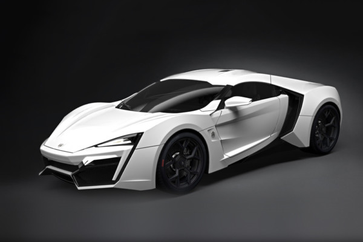

# Practica Kaggle APC UAB 2021-22
### Name: Juan Carlos Martínez Moreno  
### DATASET: Cars in the Middle East  
### URL: [kaggle](https://www.kaggle.com/bushnag/cars-in-the-middle-east)  

## Summary  
Our dataset contains information about aprox. 4000 cars from the Middle East. In the dataset there are cars from 6 differents countries: Saudi Arabia, USA, Kuwait, Bahrain, Oman and Qatar.  
We have 4000 rows and 21 columns. The columns are the attributes of the dataset that we will analyse in order to select the best attributes to do the prediction, and they are the features of a car, like the torque, Engine Capacity, Cylinders, Fuel Economy, size of the car in length, width and height, etc...  

## Objectives
